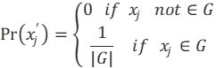

# Disclosure risk via record linkage

To measure the practical privacy resulting of the anonymization process, we measure the disclosure risk of the resulting dataset. The disclosure risk estimates the percentage of trajectories of the original dataset that can be correctly matched to the trajectories in the anonymized dataset, that is, the percentage of correct Record Linkages (RL). For an anonymized dataset X of trajectories, the record linkage is calculated as follows:

where n is the number of original trajectories and Pr⁡(x_j^') is the record linkage probability for an anonymized trajectory calculated as:

where G is the set of original trajectories that are at minimum distance from x_j^'. The spatio-temporal distance described in section 3.1.2 is used to calculate the minimum distance between trajectories. The lower RL, the lower the probability of identity disclosure and the higher the privacy of the anonymized dataset.

The computational cost of the record linkage calculation scales O(n^2 ).This is because the possible matching of each original trajectory in the anonymized dataset is searched through the entire original dataset. This search that can be unfeasible from the point of view of runtime for large datasets. To deal this problem, we propose to search possible record linkage matching in a subset of trajectories of size m instead of the entire dataset. This record linkage can estimate the disclosure risk in a feasible runtime, depending on the size of the m parameter, at the cost of lose some linkages. The higher the m the higher the accuracy of the record linkage estimation and the higher the runtime.    

## Specific parameters

- trajectory_distance (JSON object, optional, default: Martinez2021):  Name and parameters (if any) of the method to compute the distance between two trajectories. Must be one of those defined in [config.json](../mob_data_anonymizer/config.json)
- percen_window_size (float, optional, default: None): Percentage of trajectories to be considered. If it is not provided, a percentage is computed depending on the size of the dataset.
