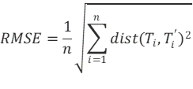

# Information loss via RSME
The utility of the anonymized dataset is measured as the information loss resulting from the anonymization of trajectories. Information loss measures the differences between the original and anonymized datasets. To do this, we use the well-known Root Mean of Square Errors (RMSE). For a given anonymized dataset X’, RMSE is defined as the sum of squares of distances between original trajectories in X and their masked versions in the anonymized dataset X’. We measure the information loss as the RMSE calculated as follows: 

where n is the number of trajectories in the dataset, T_i is a trajectory in the original dataset and T_i^'^ is the anonymized version of the trajectory T_i. To calculate the distance between trajectories (dist), we use the spatio-temporal distance described in section 3.1.2. Notice that with a high RMSE, that is, a high information loss, a lot of data are damaged, leading to a decrease of the utility of the anonymized dataset.

## Specific parameters
This measure only needs the trajectory distance to use: 
- trajectory_distance (JSON object, optional, default: Martinez2021):  Name and parameters (if any) of the method to compute the distance between two trajectories. Must be one of those defined in [config.json](../mob_data_anonymizer/config.json)